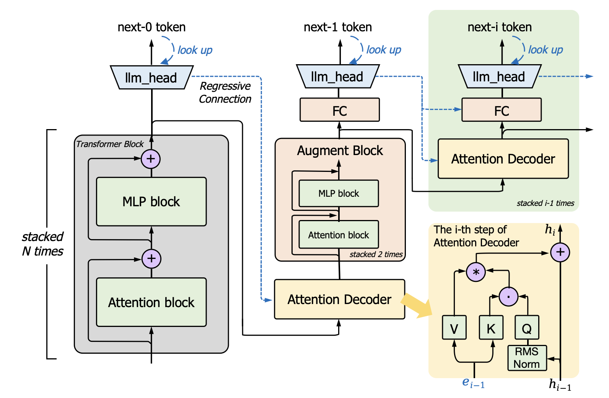
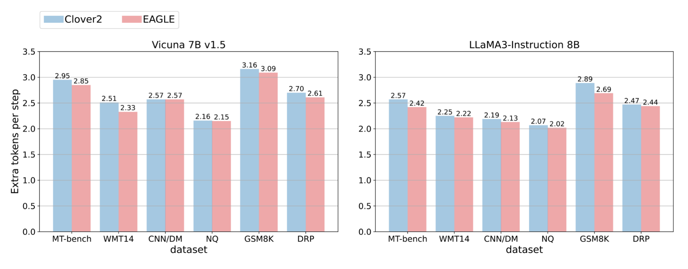
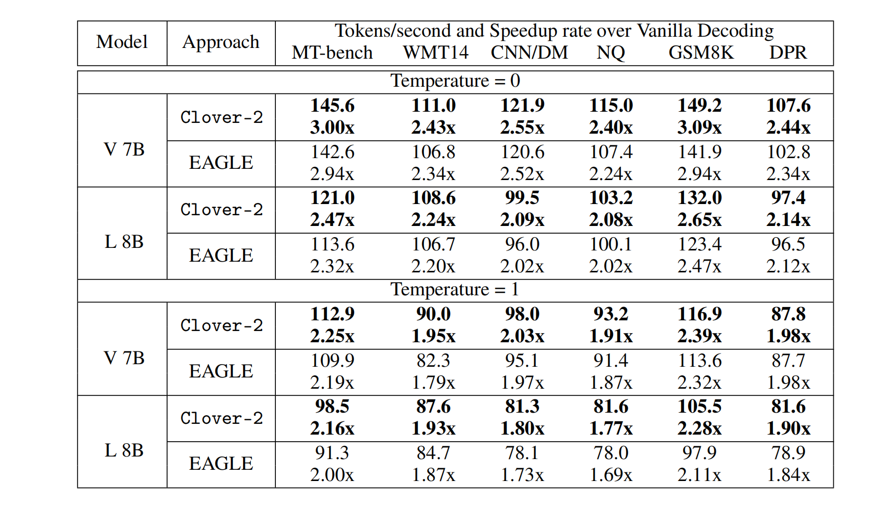

<div align="center"><h1>&nbsp;Clover: Regressive Lightweight Speculative Decoding</h1></div>

<!-- <h1 align="center">
  Clover: Regressive Lightweight Speculative Decoding
</h1> -->

<p align="center">
| <a href="https://arxiv.org/abs/2405.00263"><b>Clover Paper</b></a>
| <a href="https://arxiv.org/abs/2405.00263"><b>Clover-2 Paper</b></a> |
</p>

---

Clover-2 is an RNN-based draft model designed to achieve comparable accuracy to that of attention decoder layer models while maintaining minimal computational overhead. Clover-2 enhances the model architecture and incorporates knowledge distillation to increase Clover's accuracy and improve overall efficiency. For more details see our paper.

<div align="center">
  <picture>
  
  </picture>
  <br>
  <div align="center" width="80%">
  <em> Detailed architecture design of Clover-2 </em>
  </div>
  <br>
</div>

Despite its RNN architecture, Clover-2 also generates more
tokens per step as EAGLE across all tasks. Clover-2
delivers a maximum 7.7% speculative tokens per step and a maximum 9.3% faster speed increase on
speculative heads compared to EAGLE.

<div align="center">
  <picture>
  
  </picture>
  <br>
  <div align="center" width="80%">
  <em> Number of extra generated tokens (excluding the first one) per step on various tasks </em>
  </div>
  <br>
</div>

<div align="center">
  <picture>
  
  </picture>
  <br>
  <div align="center" width="80%">
  <em> End-to-end throughput on Vicuan 7B v1.5 (V 7B) and LLaMA3-Instruction 8B (L 8B) with different decoding methods on six tasks. </em>
  </div>
  <br>
</div>

### Setup & Installation From the source

```bash
git clone https://github.com/XiaoBin1992/clover.git
cd clover
pip install -e .
```

### Generate Train Data

You can run the following command to generate the training data.

```bash
python -m clover.ge_data.allocation --outdir [path of data]
```

### Train and Evaluation Inference

*clover/stripts* provides examples of .sh files.

### Reference
For technical details and full experimental results, please check [the paper of Clover](https://arxiv.org/abs/2405.00263) and [the paper of Clover-2](https://arxiv.org/abs/2405.00263).
<!-- ```

``` -->

### Acknowledgements

This code uses libraries from [EAGLE](https://github.com/SafeAILab/EAGLE) v1, [Medusa](https://github.com/FasterDecoding/Medusa), and [FastChat](https://github.com/lm-sys/FastChat), repository.
