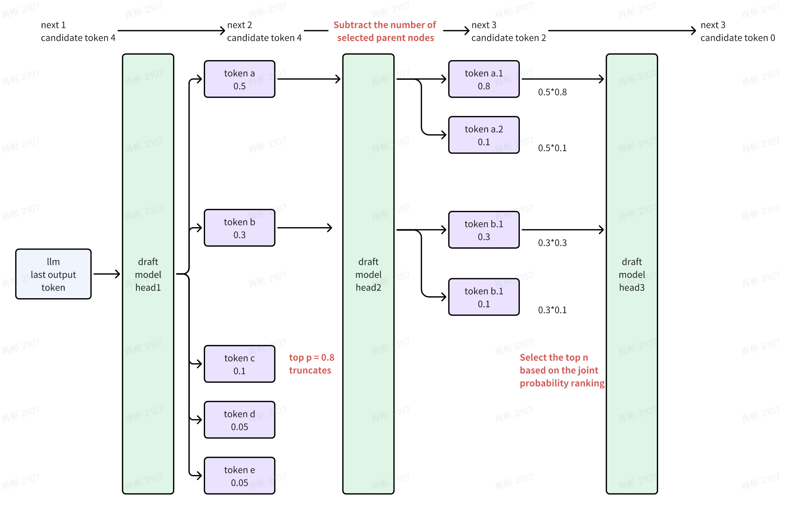

<div align="center"><h1> Clover: Regressive Lightweight Speculative Decoding</h1></div>

<!-- <h1 align="center">
  Clover: Regressive Lightweight Speculative Decoding
</h1> -->

<p align="center">
| <a href="https://arxiv.org/abs/2405.00263"><b>Clover Paper</b></a>
| <a href="https://arxiv.org/abs/2408.00264"><b>Clover-2 Paper</b></a> |
</p>

---

Clover-2 is an RNN-based draft model designed to achieve comparable accuracy to that of attention decoder layer models while maintaining minimal computational overhead. Clover-2 enhances the model architecture and incorporates knowledge distillation to increase Clover's accuracy and improve overall efficiency. For more details see our paper.

<div align="center">
  <picture>
  
  </picture>
  <br>
  <div align="center" width="80%">
  <em> Detailed architecture design of Clover-2 </em>
  </div>
  <br>
</div>

Despite its RNN architecture, Clover-2 also generates more
tokens per step as EAGLE across all tasks. Clover-2
delivers a maximum 7.7% speculative tokens per step and a maximum 9.3% faster speed increase on
speculative heads compared to EAGLE.

<div align="center">
  <picture>
  
  </picture>
  <br>
  <div align="center" width="80%">
  <em> Number of extra generated tokens (excluding the first one) per step on various tasks </em>
  </div>
  <br>
</div>

<div align="center">
  <picture>
  
  </picture>
  <br>
  <div align="center" width="80%">
  <em> End-to-end throughput on Vicuan 7B v1.5 (V 7B) and LLaMA3-Instruction 8B (L 8B) with different decoding methods on six tasks. </em>
  </div>
  <br>
</div>

### Setup & Installation From the source

```bash
git clone https://github.com/XiaoBin1992/clover.git
cd clover
pip install -e .
```

### Generate Train Data


Then, you can run the following command to generate the training data from .json files.

```bash
CUDA_VISIBLE_DEVICES=4,5  python -m clover.ge_data.allocation --python_name [python script like ge_data_all_vicuna_nonnorm.py/ge_data_all_llama3_nonnorm.py] --model_path [model path] --outdir [path of data] --dataset [ShareGPT_Vicuna_unfiltered/ShareGPT_V4.3_unfiltered_cleaned_split.json] --gpus 0,1  > info.log 2>&1 &
```

To generate evaluation data(.json files) for monitoring metrics during training, you can use the following script, using Vicuna 7B as an example:
```bash
sh scripts/7b/test_speed_base.sh
python ge_data/merge_eval_data.py
Execute command 'clover.ge_data.allocation' to obtain the final formatted data, the command usage is the same as above.
```

### Train and Evaluation Inference

clover/stripts* provides examples of .sh files.

Get indicator data:
```bash
clover/clover/evaluation/speed_spe.py --path .jsonl
clover/clover/evaluation/tau_spe.py --path .jsonl
```

<!-- ```

``` -->


### Possible improvement points
1. The Attention Decoder before the Augmenting Block is not the most effective solution. When we directly replace this module with FC, we find that some tasks improve while others decline.
2. We are using the transpose of lm_head for token embedding, which incurs additional storage costs. It can be replaced with the token emb of llm, which should only have a minimal negative impact.


### QA
1. Why is there no comparison with eagle2?

    a. Eagle2 only upgrades the sample strategy, and one of the significant variables is the increase of the token count from around 24 to about 64. The sample strategy is relatively independent of the model structure. Clover2 mainly upgrades the model structure, and this part only needs to be compared with eagle1, ensuring that all other strategies remain the same except for the model structure.

    b. Because when we started designing clover2, eagle2 had not yet been released, and migrating to eagle2 would require additional costs. We had a deadline within which we had no time to migrate.


### clover-v1 sample strategy
The complete training and inference code transformation of clover2 originates from eagle1, including the sample strategy. In fact, clover1 also involves its own sample strategy. Since clover1 considers large batch scenarios, it can only have 4 candidate tokens, making the dynamic sample strategy crucial. Below is the sample strategy of clover1, which is similar to eagle2, but it truncates according to top-p.

<div align="center">
  <picture>
  
  </picture>
  <br>
  <div align="center" width="80%">
  <em> clover-1 sample strategy. </em>
  </div>
  <br>
</div>

The main idea:
1. At the token level, tokens are discarded based on the top-p probability. To avoid situations where long-tail probabilities, such as 0.6, 0.1, 0.1, 0.1, occupy too many tokens, tokens with probabilities less than one-quarter of the top 1 probability are discarded.

2. At the tree level, the top n are selected based on the joint probability ranking.

3. At the head level, the number of candidate tokens available after each head is completed is reduced by the number of tokens already selected.


### Reference

For technical details and full experimental results, please check [the paper of Clover](https://arxiv.org/abs/2405.00263) and [the paper of Clover-2](https://arxiv.org/abs/2408.00264).

### Acknowledgements

This code uses libraries from [EAGLE](https://github.com/SafeAILab/EAGLE) v1, [Medusa](https://github.com/FasterDecoding/Medusa), and [FastChat](https://github.com/lm-sys/FastChat), repository.
